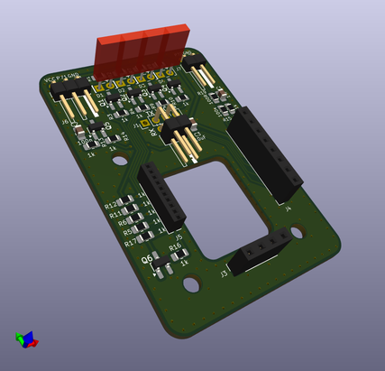

# Doorlockd card reader
This repository contains the design for a small PCB for an NFC card
reader to be used with the doorlockd door access system.

The PCB stacks on top of the the [Elechouse PN532 NFC reader
board](https://www.elechouse.com/product/pn532-nfc-rfid-module-v4/) and
adds indicator LEDs and a four-pin connector for a UART connection to
a controller.

This PCB is designed to be used with the [doorlockd hardware and
software](https://github.com/doorlockd/), but can also be used with any
other controller that can provide 5V and can talk over a UART.

In addition to the PCB, a 3D-printed case was made. Design files for
that will hopefully be published later.

See the [doorlockd organization page](https://github.com/doorlockd/) for
some photographs of the card reader PCB in practice.

## Features
This PCB provides:

 - UART connection the the PN532 board, using a square (2x2) connector
   with standard 2.54mm pitch. The square connector makes it easy to
   feed the cable through a round hole in e.g. a door frame.
 - Four indicator LEDs.
 - One open-drain output pin, to control external LEDs, a solenoid, etc.
 - One input pin, to read an external button, switch, etc.

The LEDs, output and input pin are driven/read by I/O pins on the PN532
NFC chip and can be individually controlled/read by sending the proper
commands via UART.

## License
Copyright 2021-2025 Matthijs Kooijman (matthijs@stdin.nl)

This source describes Open Hardware and is licensed under the CERN-OHL-P
v2 or any later version.

You may redistribute and modify this documentation and make products
using it under the terms of the CERN-OHL-P v2 (https:/cern.ch/cern-ohl).

This documentation is distributed WITHOUT ANY EXPRESS OR IMPLIED
WARRANTY, INCLUDING OF MERCHANTABILITY, SATISFACTORY QUALITY AND FITNESS
FOR A PARTICULAR PURPOSE. Please see the CERN-OHL-P v2 for applicable
conditions

See LICENSE.txt for the full license text.
